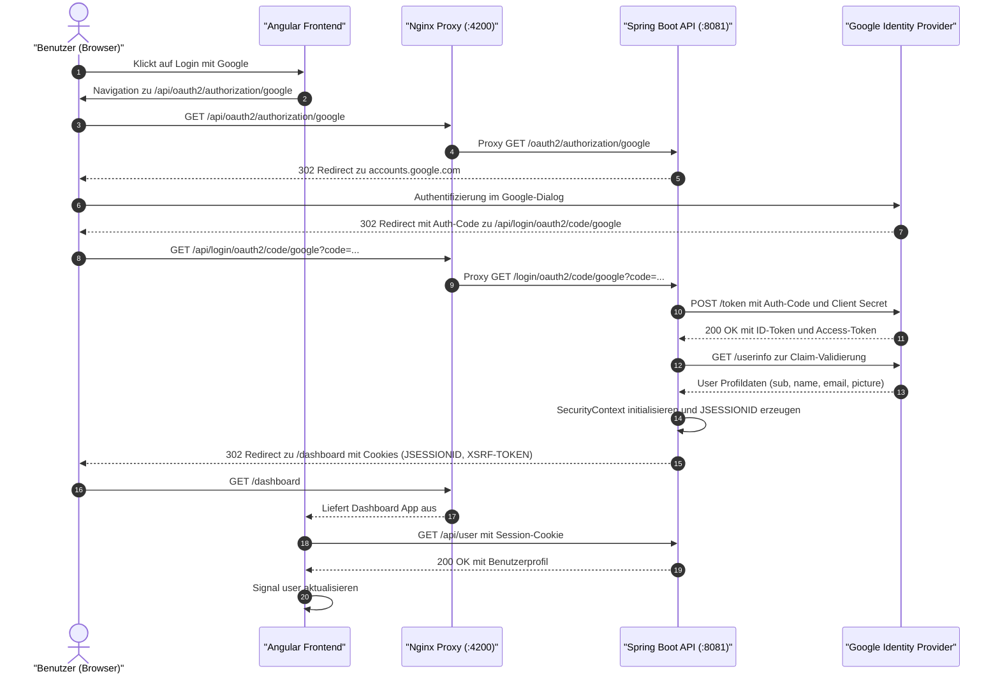
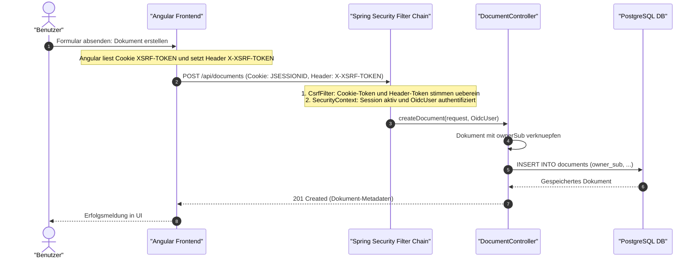
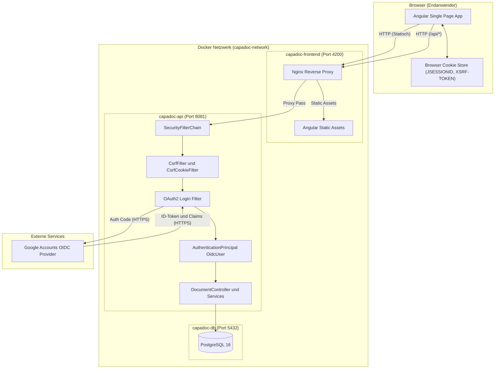

# OAuth2 & Google Login Architektur-Dokumentation

Diese Dokumentation beschreibt die vollständige Konzeption, technische Implementierung und architektonische Begründung der Authentifizierung und Autorisierung im Projekt **CapaDoc** (Spring Boot Backend + Angular Frontend).

---

## Inhaltsverzeichnis
1. [Architekturüberblick (BFF-Pattern)](#1-architekturüberblick-bff-pattern)
2. [Mermaid Ablauf- und Architekturdiagramme](#2-mermaid-ablauf--und-architekturdiagramme)
   - [End-to-End Login Flow](#end-to-end-login-flow-oidc--authorization-code-flow)
   - [Autorisierte API-Aufrufe mit CSRF-Schutz](#autorisierte-api-aufrufe-mit-csrf-schutz)
   - [Komponenten- und Netzwerkarchitektur](#komponenten--und-netzwerkarchitektur)
3. [Backend-Implementierung (Spring Boot)](#3-backend-implementierung-spring-boot)
   - [Spring Security Konfiguration](#spring-security-konfiguration)
   - [CSRF-Schutz & CsrfCookieFilter](#csrf-schutz--csrfcookiefilter)
   - [Session-Handling & User-Endpoint](#session-handling--user-endpoint)
   - [Mandantentrennung & Owner-basierte Zugriffskontrolle](#mandantentrennung--owner-basierte-zugriffskontrolle)
4. [Frontend-Implementierung (Angular)](#4-frontend-implementierung-angular)
   - [AuthService & State Management mit Signals](#authservice--state-management-mit-signals)
   - [App-Initialisierung (provideAppInitializer)](#app-initialisierung-provideappinitializer)
   - [Nginx Reverse Proxy & Cookie-Handling](#nginx-reverse-proxy--cookie-handling)
5. [Architekturentscheidungen – Das "Warum"](#5-architekturentscheidungen--das-warum)
   - [BFF + Session Cookies vs. SPA Token Storage](#warum-bff--session-cookies-statt-jwt-im-localstorage)
   - [OpenID Connect (OIDC) vs. eigene Benutzerverwaltung](#warum-openid-connect-google-oauth2)
   - [Verwendung der Google Subject-ID (`sub`)](#warum-die-google-subject-id-sub-statt-der-e-mail)
   - [Notwendigkeit des CSRF-Schutzes](#warum-csrf-schutz-bei-cookie-authentifizierung-unerlässlich-ist)
6. [Leitfaden für API-Testing (Bruno & Postman)](#6-leitfaden-für-api-testing-bruno--postman)

---

## 1. Architekturüberblick (BFF-Pattern)

Für CapaDoc wurde das etablierte **Backend-For-Frontend (BFF)** Sicherheitsmuster gewählt:
* Das **Frontend (Angular)** agiert als reine Darstellungs- und Logikschicht im Browser und besitzt **keinerlei OAuth2-Client-Secrets**.
* Das **Backend (Spring Boot)** fungiert als vertraulicher OAuth2-Client (*Confidential Client*), führt den Authorization-Code-Flow mit Google durch und verwaltet die Session.
* Die Kommunikation zwischen Browser und Backend erfolgt über **sitzungsbasierte Cookies (`JSESSIONID`)**, geschützt durch ein **Double-Submit-CSRF-Token (`XSRF-TOKEN`)**.

```
┌────────────────────────────────────────────────────────────────────────┐
│ BROWSER                                                                │
│  ┌───────────────────────┐         ┌────────────────────────────────┐  │
│  │   Angular Frontend    │ ◄─────► │  Browser Cookie Storage        │  │
│  │   (Signals & HTTP)    │         │  - JSESSIONID (HttpOnly)       │  │
│  └──────────┬────────────┘         │  - XSRF-TOKEN (JavaScript)     │  │
│             │                      └────────────────────────────────┘  │
└─────────────┼──────────────────────────────────────────────────────────┘
              │  (Reverse Proxy / Same-Origin: http://localhost:4200)
              ▼
┌────────────────────────────────────────────────────────────────────────┐
│ NGINX (Reverse Proxy)                                                  │
│   /          --> Angular Static Files (Port 80)                        │
│   /api/      --> Spring Boot API (Port 8081)                           │
└─────────────┬──────────────────────────────────────────────────────────┘
              │
              ▼
┌────────────────────────────────────────────────────────────────────────┐
│ SPRING BOOT BACKEND (Port 8081)                                        │
│  - Spring Security Filter Chain                                        │
│  - OAuth2 Login Client (Google OIDC)                                   │
│  - CSRF Filter (CookieCsrfTokenRepository)                             │
│  - Dokument-Zugriffskontrolle nach Google `sub`                        │
└─────────────┬──────────────────────────────────────────────────────────┘
              │  (HTTPS Backchannel)
              ▼
┌──────────────────────────────────────────────┐
│ GOOGLE IDENTITY PROVIDER (accounts.google.com)│
│  - OAuth2 Authorization Endpoint             │
│  - Token Endpoint & UserInfo Endpoint        │
└──────────────────────────────────────────────┘
```

---

## 2. Mermaid Ablauf- und Architekturdiagramme

### End-to-End Login Flow (OIDC / Authorization Code Flow)



---

### Autorisierte API-Aufrufe mit CSRF-Schutz



---

### Komponenten- und Netzwerkarchitektur



---

## 3. Backend-Implementierung (Spring Boot)

### Spring Security Konfiguration
Die zentrale Sicherheitskonfiguration liegt in [`SecurityConfig.java`](file:///home/pascal/Downloads/SWEN3_Capa_Doc/SWEN3_Capa_Doc/CapaDocAPI/src/main/java/at/capadocapi/config/SecurityConfig.java):

```java
@Configuration
@EnableWebSecurity
public class SecurityConfig {

    @Bean
    public PasswordEncoder passwordEncoder() {
        return new BCryptPasswordEncoder();
    }

    @Bean
    SecurityFilterChain filterChain(HttpSecurity http,
                                    @Value("${app.frontend-url:http://localhost}") String frontendUrl) throws Exception {
        http
                .authorizeHttpRequests(a -> a
                        // Öffentliche Endpunkte (ohne Login erreichbar)
                        .requestMatchers(HttpMethod.GET, "/links/{shortCode}", "/api/links/{shortCode}").permitAll()
                        .requestMatchers("/api/ping", "/ping", "/error").permitAll()
                        // Alle anderen Endpunkte erfordern eine aktive Session
                        .anyRequest().authenticated())
                // Startet den standardisierten Spring Security OIDC-Login
                .oauth2Login(o -> o.defaultSuccessUrl(frontendUrl + "/dashboard", true))
                // Nicht authentifizierte API-Zugriffe liefern 401 statt Redirect zur Login-Page
                .exceptionHandling(e -> e
                        .authenticationEntryPoint(new HttpStatusEntryPoint(HttpStatus.UNAUTHORIZED)))
                // Logout invalidiert Session und Cookies
                .logout(l -> l.logoutSuccessHandler(new HttpStatusReturningLogoutSuccessHandler()))
                // CSRF Schutz mit lesbarem Cookie für Single Page Applications
                .csrf(c -> c
                        .csrfTokenRepository(CookieCsrfTokenRepository.withHttpOnlyFalse())
                        .csrfTokenRequestHandler(new CsrfTokenRequestAttributeHandler()))
                .addFilterAfter(new CsrfCookieFilter(), BasicAuthenticationFilter.class);

        return http.build();
    }
}
```

#### Kernpunkte:
1. **`HttpStatusEntryPoint(HttpStatus.UNAUTHORIZED)`**:
   Standardmäßig leitet Spring Security nicht-authentifizierte Anfragen mit `302 Found` auf die Google-Login-Seite um. Für REST-APIs ist das unerwünscht, da JavaScript-Clients (Angular, Bruno) einen HTTP-Status `401 Unauthorized` erwarten, um programmatisch reagieren zu können.
2. **`defaultSuccessUrl(..., true)`**:
   Nach erfolgreicher Authentifizierung bei Google wird der Browser zwingend auf `/dashboard` des Frontends zurückgeleitet.
3. **`server.forward-headers-strategy=framework`**:
   In `application.properties` aktiviert. Sorgt dafür, dass Spring Boot hinter dem Nginx Reverse-Proxy die korrekten Headers (`X-Forwarded-Proto`, `X-Forwarded-Host`) auswertet und die Google-Redirect-URI nicht fälschlich mit `http://api:8081` generiert wird.

---

### CSRF-Schutz & CsrfCookieFilter
Damit Single Page Applications (SPAs) geschützt gegen Cross-Site Request Forgery sind, kommt das **Double-Submit-Cookie-Pattern** zum Einsatz:

1. **`CookieCsrfTokenRepository.withHttpOnlyFalse()`**:
   Spring Boot legt das Cookie `XSRF-TOKEN` so an, dass `HttpOnly=false` gilt. Dadurch kann der Angular HttpClient das Cookie per JavaScript auslesen.
2. **[`CsrfCookieFilter.java`](file:///home/pascal/Downloads/SWEN3_Capa_Doc/SWEN3_Capa_Doc/CapaDocAPI/src/main/java/at/capadocapi/config/CsrfCookieFilter.java)**:
   Spring Security lädt CSRF-Tokens standardmäßig *deferred* (verzögert erst bei der ersten Mutation). Da Single Page Apps das Cookie bereits für den ersten POST-Request benötigen, erzwingt dieser Filter bei jedem Request das Laden und Schreiben des Cookies:
   ```java
   public class CsrfCookieFilter extends OncePerRequestFilter {
       @Override
       protected void doFilterInternal(HttpServletRequest req, HttpServletResponse res,
                                       FilterChain chain) throws ServletException, IOException {
           CsrfToken token = (CsrfToken) req.getAttribute(CsrfToken.class.getName());
           if (token != null) {
               token.getToken(); // Erzwingt das Setzen des XSRF-TOKEN-Cookies in der HTTP-Response
           }
           chain.doFilter(req, res);
       }
   }
   ```

---

### Session-Handling & User-Endpoint
Der [`UserController.java`](file:///home/pascal/Downloads/SWEN3_Capa_Doc/SWEN3_Capa_Doc/CapaDocAPI/src/main/java/at/capadocapi/controller/UserController.java) erlaubt es dem Frontend abzufragen, wer aktuell eingeloggt ist:

```java
@RestController
@RequestMapping
public class UserController {

    @GetMapping({"/user", "/api/user"})
    public Map<String, Object> me(@AuthenticationPrincipal OidcUser user) {
        if (user == null) {
            return Map.of();
        }
        return Map.of(
                "sub", user.getSubject() != null ? user.getSubject() : "",
                "name", user.getFullName() != null ? user.getFullName() : "",
                "email", user.getEmail() != null ? user.getEmail() : "",
                "picture", user.getPicture() != null ? user.getPicture() : ""
        );
    }
}
```
* Über die Annotation `@AuthenticationPrincipal OidcUser user` injiziert Spring Security das verifizierte OpenID-Connect-Objekt direkt aus der Session.

---

### Mandantentrennung & Owner-basierte Zugriffskontrolle
In [`DocumentController.java`](file:///home/pascal/Downloads/SWEN3_Capa_Doc/SWEN3_Capa_Doc/CapaDocAPI/src/main/java/at/capadocapi/controller/DocumentController.java) wird sichergestellt, dass Benutzer nur ihre eigenen Dokumente manipulieren oder einsehen können:

```java
@PostMapping
public ResponseEntity<DocumentResponseDTO> createDocument(
        @Valid @RequestBody DocumentRequestDTO request,
        @AuthenticationPrincipal OidcUser user) {
    DocumentEntity toCreate = documentMapper.toEntity(request);
    if (user != null) {
        toCreate.setOwnerSub(user.getSubject()); // Bindung an Google Subject-ID
    }
    DocumentEntity created = documentService.createDocument(toCreate);
    return new ResponseEntity<>(documentMapper.toResponseDto(created), HttpStatus.CREATED);
}

@GetMapping
public List<DocumentResponseDTO> getAllDocuments(@AuthenticationPrincipal OidcUser user) {
    List<DocumentEntity> documents = (user != null)
            ? documentService.getDocumentsByOwner(user.getSubject())
            : documentService.getAllDocuments();
    return documents.stream().map(documentMapper::toResponseDto).toList();
}

private boolean isForbidden(DocumentEntity doc, OidcUser user) {
    if (user == null) {
        return false;
    }
    // Prüfung: Gehört das Dokument dem aktuellen User?
    return doc.getOwnerSub() != null && !doc.getOwnerSub().equals(user.getSubject());
}
```

---

## 4. Frontend-Implementierung (Angular)

### AuthService & State Management mit Signals
Im Frontend kapselt der [`AuthService`](file:///home/pascal/Downloads/SWEN3_Capa_Doc/SWEN3_Capa_Doc/CapaDocFrontend/src/app/services/auth/auth.ts) sämtliche Login- und Benutzerzustände reaktiv über **Angular Signals**:

```typescript
export interface User {
  sub?: string;
  name?: string;
  email?: string;
  picture?: string;
}

@Injectable({ providedIn: 'root' })
export class AuthService {
  private readonly http = inject(HttpClient);
  private readonly router = inject(Router);

  private readonly _user = signal<User | null>(null);

  /** Aktueller User (readonly) oder null */
  readonly user = this._user.asReadonly();
  /** Reaktiv abgeleiteter Login-Status */
  readonly isLoggedIn = computed(() => this._user() !== null);

  /** Fragt das Backend beim Start nach dem eingeloggten User */
  async loadUser(): Promise<void> {
    try {
      const user = await firstValueFrom(this.http.get<User>('/api/user'));
      this._user.set(user);
    } catch {
      this._user.set(null);
    }
  }

  /** Leitet den Browser für den OAuth2-Flow an das Backend weiter */
  login(): void {
    window.location.href = '/api/oauth2/authorization/google';
  }

  /** Beendet die Session und leitet auf die Landing-Page */
  logout(): void {
    this.http.post('/api/logout', {}).subscribe({
      next: () => this.afterLogout(),
      error: () => this.afterLogout(),
    });
  }

  private afterLogout(): void {
    this._user.set(null);
    this.router.navigate(['/']);
  }
}
```

---

### App-Initialisierung (provideAppInitializer)
In [`app.config.ts`](file:///home/pascal/Downloads/SWEN3_Capa_Doc/SWEN3_Capa_Doc/CapaDocFrontend/src/app/app.config.ts) wird der Login-Status beim Laden der Anwendung synchron geprüft, noch bevor Routen gerendert werden:

```typescript
export const appConfig: ApplicationConfig = {
  providers: [
    provideRouter(routes),
    provideHttpClient(),
    // Prüft bestehende Session vor dem initialen Rendern der App:
    provideAppInitializer(() => inject(AuthService).loadUser()),
  ]
};
```
* **Vorteil:** Kein Flackern der Navigation ("Flicker"): Komponenten wie die Navbar wissen sofort, ob der User angemeldet ist (`auth.isLoggedIn()`), und zeigen direkt das Avatar-Bild oder den Login-Button.

---

### Nginx Reverse Proxy & Cookie-Handling
Die [`nginx.conf`](file:///home/pascal/Downloads/SWEN3_Capa_Doc/SWEN3_Capa_Doc/CapaDocFrontend/nginx.conf) verbindet Frontend und API unter einem gemeinsamen Host (`localhost:4200`):

```nginx
server {
    listen 80;
    server_name localhost;

    root /usr/share/nginx/html;
    index index.html;

    location / {
        try_files $uri $uri/ /index.html;
    }

    location /api/ {
        proxy_pass http://api:8081/;
        proxy_set_header Host $http_host;
        proxy_set_header X-Forwarded-Proto $scheme;
        proxy_set_header X-Forwarded-For $proxy_add_x_forwarded_for;
    }
}
```
* **Warum wichtig?** 
  Dadurch laufen Frontend (`/`) und API (`/api/`) unter derselben Origin. Das verhindert Third-Party-Cookie-Blockaden moderner Browser (Safari, Chrome Privacy Sandbox) und vereinfacht CORS drastisch.

---

## 5. Architekturentscheidungen – Das "Warum"

### Warum BFF + Session Cookies statt JWT im localStorage?
Eine verbreitete Alternative ist, dass die SPA Tokens (Access/ID-Token) direkt empfängt und im `localStorage` speichert. Wir haben uns bewusst für das **BFF-Pattern mit Session Cookies** entschieden:

| Kriterium | BFF mit HttpOnly Cookies (gewählt) | Token im localStorage (verworfen) |
| :--- | :--- | :--- |
| **XSS-Sicherheit** | **Sehr hoch:** JavaScript kann das `JSESSIONID`-Cookie nicht lesen (`HttpOnly`). | **Gering:** Beliebiges XSS-Script kann den gesamten `localStorage` auslesen und Tokens stehlen. |
| **Geheimhaltung des Secrets** | **Sicher:** `GOOGLE_CLIENT_SECRET` bleibt auf dem Server. | **Unsicher:** Entweder muss PKCE ohne Secret genutzt werden oder Secrets geraten in Client-Code. |
| **Token-Revocation / Logout** | **Sofort:** Backend invalidiert Session; ab sofort ist jeder Request blockiert. | **Schwierig:** Reines JWT ist bis zum Ablaufdatum gültig, außer es wird eine Blacklist geführt. |
| **Client-Komplexität** | **Minimal:** Browser verwaltet Cookies automatisch. | **Hoch:** Angular müsste Token-Refresh, Ablaufprüfungen und Retry-Logiken selbst implementieren. |

---

### Warum OpenID Connect (Google OAuth2)?
1. **Keine Speicherung sensibler Passwörter:** CapaDoc muss keine Passwörter in der Datenbank hashen, salzen oder schützen. Das Risiko von Credential-Leaks entfällt.
2. **Kostenlose Multi-Faktor-Authentifizierung (MFA):** Google übernimmt fortschrittliche Sicherheitsmechanismen wie 2FA, Passkeys und verdächtige Login-Erkennung.
3. **Hohe Benutzerakzeptanz:** Benutzer müssen kein neues Konto anlegen ("One-Click Login").

---

### Warum die Google Subject-ID (`sub`) statt der E-Mail?
In `DocumentController` und in der Datenbank wird `owner_sub` gespeichert und nicht die E-Mail-Adresse:
* **E-Mail-Adressen sind veränderlich:** Ein Nutzer kann seine primäre Google-Adresse ändern oder aliases nutzen.
* **`sub` ist unveränderlich:** Laut [OpenID Connect Core Spezifikation](https://openid.net/specs/openid-connect-core-1_0.html) ist der `sub`-Claim (Subject Identifier) eine maximal 255 Zeichen lange, unveränderliche und eindeutige Kennung des Nutzers beim Identity Provider.
* **Datenschutz:** Der `sub`-Identifier ist ein kryptischer String und enthält keine personenbezogenen Daten im Klartext in Fremdschlüsseltabellen.

---

### Warum CSRF-Schutz bei Cookie-Authentifizierung unerlässlich ist
Weil der Browser das Session-Cookie `JSESSIONID` bei allen Anfragen an die Domain automatisch mitsendet, wäre die Anwendung ohne CSRF-Schutz anfällig für Angriffe:
* Eine bösartige Webseite `evil.com` könnte per `<form action="http://localhost:4200/api/documents" method="POST">` im Namen des Opfers Dokumente anlegen oder löschen.
* **Gegenmaßnahme:** Das Double-Submit-CSRF-Token. Die fremde Webseite kann das `XSRF-TOKEN`-Cookie aufgrund der *Same-Origin Policy* nicht auslesen und daher den Header `X-XSRF-TOKEN` nicht setzen. Spring Security weist die Anfrage ab (`403 Forbidden`).

---

## 6. Leitfaden für API-Testing (Bruno & Postman)

Da API-Clients (wie Bruno) nicht wie ein normaler Browser am OAuth2-Redirect-Flow teilnehmen, müssen Tests wie folgt aufgebaut sein:

1. **Einmaliger Login im Browser:**
   * Browser öffnen: `http://localhost:4200` -> Mit Google einloggen.
   * Entwicklertools (`F12`) öffnen -> **Application** (bzw. **Speicher**) -> **Cookies**.
   * Die Werte von `JSESSIONID` und `XSRF-TOKEN` kopieren.

2. **In Bruno einpflegen:**
   * In Bruno das Environment `Local` öffnen.
   * `sessionId`: Wert von `JSESSIONID` eintragen.
   * `xsrfToken`: Wert von `XSRF-TOKEN` eintragen.

3. **Automatische Injektion via Collection-Pre-Request Script:**
   * In `opencollection.yml` ist folgendes Skript hinterlegt, welches vor jeder Anfrage ausgeführt wird:
   ```javascript
   const sid = bru.getEnvVar("sessionId");
   const xsrf = bru.getEnvVar("xsrfToken");
   if (sid) {
     req.setHeader("Cookie", `JSESSIONID=${sid}; XSRF-TOKEN=${xsrf || ""}`);
   }
   if (xsrf) {
     req.setHeader("X-XSRF-TOKEN", xsrf);
   }
   ```
4. **Bruno Cookie-Speicherung deaktivieren:**
   * In Bruno: `Preferences` -> `General` -> `Store Cookies automatically` **ausschalten**, damit Antworten von Test-Endpunkten (wie `Ping`) nicht versehentlich das hinterlegte Session-Cookie überschreiben.
